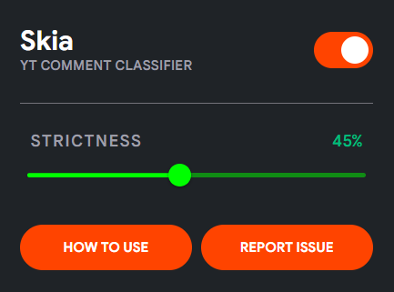

<h1>Skia: Youtube Comments Classifier</h1>
Skia is a tool and browser extension that automatically rates the quality of youtube comments and filters out unnecessary ones. Everything runs on your computer with very few resources.

### Install
- Google Chrome Webstore (will be added soon)
- Mozilla Firefox Addons (will be added soon)
- Microsoft Edge Addons (will be added soon)

### Objective
Studies show that spammers evolve faster than viruses, making the [Dead Internet Theory](https://en.wikipedia.org/wiki/Dead_Internet_theory) real. They can be corporate, clankers (bots) or lil ipad kids. It can even be your neighborhood cat 🐱.
These spam comments take up ~40% of the comments in videos which are for all ages. 
I could not find any good way of removing these comments, which wastes my time while reading comments, so I created this comment classifier. 

 ***Is this just another spam filter chrome extension ?*** 
> Nope! You choose the quality of comments, whether you want them to be good, bad or in between. This tool adapts to evolving spammers automatically as it uses semantic analysis model, and gives every comment rating on its quality. Everything runs offline.

***Is this tool fully perfect ?*** 
> No. It may remove some comments which it classes as low effort but you find them interesting. Don't worry, you can always reduce its strictness.

### Demo

**Extension popup** 

 

**Example usage** 

https://github.com/user-attachments/assets/3c114058-c9a4-464e-9121-3001496447be

## Setup
1. Go to the store's installation page, and click install.
2. Open the extension popup once, and let it download the files which will be used internally. **Do not close the browser while its downloading files** (you may close the popup).
3. Control menu will show up in the popup once all the files are downloaded, and you are good to go! Enjoy.

## Build & Train
If you want to build the extension from start, you can follow the [build guide](extension/README.md). If you intend to train the model weights, you can follow [training guide](trainer/README.md).

## License & Contributions
This project and weights are licensed under the [AGPL-3.0 License](LICENSE).

Contributions are very much welcome! Please fork the repository and submit a pull request with your changes, and I'll try to review, merge and publish promptly! 🤝

## Credits
- [Xenova/all-MiniLM-L6-v2](https://huggingface.co/Xenova/all-MiniLM-L6-v2)

  and other contributors.